# 🛡️ Autonomous Security Investigation Platform (ASIP)

ASIP is an enterprise-grade, **evidence-first**, **graph-native** security investigation swarming engine. Instead of acting as a simple Q&A chatbot, ASIP thinks like a senior SOC Lead and Incident Responder: it receives telemetry archives, correlates process execution paths, queries internal playbooks, validates findings via adversarial QA check-loops, and formats automated containment reports.

```
┌────────────────────────────────────────────────────────────────────────┐
│                                 ASIP                                   │
│            Autonomous Swarm Security Investigation Platform            │
└────────────────────────────────────────────────────────────────────────┘
          │                                           │
          ▼ Ingest logs (ZIP/7z/EVTX/CSV)             ▼ Alert Webhooks (Splunk/EDR)
┌───────────────────────────────────┐       ┌────────────────────────────────────┐
│      Recursive Extraction         │       │     Webhook normalization route    │
│  (Interactive Decryption Prompt)  │       │   (CrowdStrike, Wazuh, SecOps)     │
└─────────────────┬─────────────────┘       └─────────────────┬──────────────────┘
                  │                                           │
                  └─────────────────────┬─────────────────────┘
                                        │ Universal Event Schema (UES)
                                        ▼
                            ┌───────────────────────┐
                            │ SQLite/Postgres DB    │
                            └───────────┬───────────┘
                                        │
                 ┌──────────────────────┴──────────────────────┐
                 ▼                                             ▼
┌───────────────────────────────────┐       ┌────────────────────────────────────┐
│  Entity Process Correlation Graph │       │   Semantic Vector Database (RAG)   │
│  - SPAWNED parent-child trees     │       │   - Corporate IR Playbooks         │
│  - CONNECTED_TO network links     │       │   - Curated MITRE ATT&CK Corpus    │
│  - CREATED file system trace      │       │   - Historical Incidents Memory    │
└────────────────┬──────────────────┘       └─────────────────┬──────────────────┘
                 │                                            │
                 └──────────────────────┬─────────────────────┘
                                        │ Context mapping inject
                                        ▼
                            ┌───────────────────────┐
                            │ LangGraph Agent Swarm │
                            │                       │
                            │ 1. Threat Triage      │
                            │ 2. Correlation & RCA  │
                            │ 3. Adversarial QA     │ ◄── [Fails: Loops back to RCA]
                            │ 4. Executive Report   │
                            └───────────┬───────────┘
                                        │
                                        ▼
                            ┌───────────────────────┐
                            │ Actionable Playbook & │
                            │  Incident Briefing    │
                            └───────────────────────┘
```

---

## 🚀 Key Features

*   **Recursive Decryption Gateway**: Automatically extracts zip, 7z, and tar archives recursively. If an archive is password-protected, the pipeline pauses, updates state to `awaiting_password`, and triggers an interactive frontend decryption prompt.
*   **Multi-Platform Log Normalizer**: Programmatically parses Splunk CSV exports, Wazuh alerts, Windows Event binary EVTX files, Sysmon telemetry, Google SecOps UDM formats, and CrowdStrike process tables into the unified **Universal Event Schema (UES)**.
*   **Swarm Agent Orchestration (LangGraph)**: Orchestrates four focused agent nodes inside an iterative state machine:
    1.  **Triage Agent**: Contextualizes alerts and maps threat indicators.
    2.  **RCA Agent**: Reconstructs execution flow using the correlation graph.
    3.  **Adversarial QA Agent**: Challenges findings, ensuring every claim is backed by a verified database log citation.
    4.  **Reporting Agent**: Generates containment strategies (Immediate, Short, Long-term) and incident reports.
*   **Knowledge Base & Incident Memory RAG**: Queries a semantic vector store (Qdrant with memory fallback) to surface standard playbooks, MITRE ATT&CK mappings, and historical incidents matching the alert context.
*   **Enterprise Webhook Intake**: Exposes real-time API receivers that parse alerts from SIEMs/EDRs and trigger automated triage tasks immediately in the background.
*   **Wow-Factor Dashboard UI**: High-end cyberpunk-styled dark interface with glassmorphic cards, execution chain processes viewer, active agent checklists, and interactive timeline components.

---

## 📁 Project Directory Layout

```
Helios/
├── requirements.txt            # Python dependencies (fastapi, langgraph, EVTX, aiosqlite)
├── docker-compose.yml          # Services definition (Postgres, Redis, Qdrant)
├── asip/                       # Core python backend module
│   ├── core/
│   │   ├── config.py           # Configuration model and directory setup
│   │   ├── database.py         # Async engine factory (PostgreSQL / SQLite)
│   │   └── models.py           # UES and Investigation schemas
│   ├── intake/
│   │   ├── gateway.py          # Recursive zip/7z extraction gateway
│   │   ├── normalizer.py       # Normalizer coordinator
│   │   └── parsers/            # Sysmon, splunk, wazuh, crowdstrike formats
│   ├── graph/
│   │   └── entity_graph.py     # NetworkX forensic correlation tree builder
│   ├── enrichment/
│   │   ├── virustotal.py       # IP/Hash enrichment client
│   │   └── manager.py          # Threat intelligence manager
│   ├── rag/
│   │   ├── vector_store.py     # Vector store client (Qdrant & shared mock)
│   │   ├── playbook_rag.py     # Indexer for ATT&CK techniques & playbooks
│   │   └── incident_memory.py  # Cross-incident semantic storage
│   ├── agents/
│   │   ├── orchestrator.py     # LangGraph orchestrator state-machine
│   │   ├── triage_agent.py     # Classification agent
│   │   ├── rca_agent.py        # Correlation & RCA agent
│   │   ├── qa_agent.py         # Verification QA validator
│   │   └── report_agent.py     # Case playbook compiler
│   ├── api/
│   │   ├── main.py             # FastAPI entry point
│   │   └── routes/
│   │       ├── investigate.py  # File upload and triage endpoint
│   │       └── webhooks.py     # SIEM Alert ingestion endpoint
│   └── models/
│       └── llm_clients.py      # OpenAI/Anthropic/Ollama routers with fallback
└── frontend/                   # React web dashboard
    ├── src/
    │   ├── App.jsx             # Main dashboard UI
    │   ├── index.css           # Glassmorphism styling & color tokens
    │   └── main.jsx            # React mounting hook
    ├── index.html
    └── vite.config.js
```

---

## ⚙️ Core Flow Diagram

```mermaid
sequenceDiagram
    autonumber
    actor Analyst as Security Analyst
    participant API as FastAPI Backend
    participant Gateway as Intake Gateway
    participant Normalizer as Log Normalizer
    participant Graph as Entity Graph Builder
    participant Store as Vector Store Manager
    participant LangGraph as LangGraph Agent Swarm

    Analyst->>API: Post /upload (ZIP Archive / Alert Details)
    API->>Gateway: Recursive Unpack (magic bytes checking)
    alt Archive is Password Protected
        Gateway-->>API: Throw PasswordRequiredError
        API-->>Analyst: Return status "awaiting_password" & prompt UI
        Analyst->>API: Post /password (Decryption password)
        API->>Gateway: Retry Unpack with Password
    end
    Gateway->>API: Yield Extracted Logs list
    API->>Normalizer: Parse and map records to UES
    Normalizer->>API: Save normalized logs in SQLite/Postgres DB
    API->>Graph: Map UES records into network flows
    Graph-->>API: Return Nodes & Edges (SPAWNED, CONNECTED_TO)
    API->>LangGraph: TriggerSwarm (state context + logs + graph)
    
    rect rgb(20, 24, 33)
        note right of LangGraph: Multi-Agent Reason Iteration
        LangGraph->>Store: Query similar incidents & playbook vectors
        Store-->>LangGraph: Return matching contextual vectors
        LangGraph->>LangGraph: RCA CoT Reasoning (triage -> rca)
        LangGraph->>LangGraph: Validate findings (qa verification check)
        loop QA Validator Rejections
            LangGraph->>LangGraph: Correct inaccuracies and cite line counts
        end
        LangGraph->>LangGraph: Compile containment playbooks
    end

    LangGraph->>API: Update investigation row & save compiled Markdown report
    API-->>Analyst: Stream complete Incident Summary & Mitigation widgets
```



---

## 🛠️ Installation & Setup

### Prerequisites
*   **Python**: `>= 3.10`
*   **Node.js**: `>= 18.0`
*   **Ollama (Optional for local analysis)**: Standard install running `qwen2.5:14b` or `llama3.3`

### 1. Configure the Environment
Create a `.env` file in the root workspace folder:
```env
# Application Settings
PROJECT_NAME="ASIP Swarm"

# Database Configuration (Postgres or local SQLite fallback)
DATABASE_URL="sqlite+aiosqlite:///asip.db"

# API Keys (Provide keys for actual LLM runs, otherwise mock mocks run)
OPENAI_API_KEY="sk-proj-..."
ANTHROPIC_API_KEY="sk-ant-..."

# Local Inference Setup
OLLAMA_BASE_URL="http://localhost:11434"
LOCAL_MODEL="qwen2.5:14b"
CLOUD_MODEL="claude-3-5-sonnet-20241022"

# Vector DB & Embeddings Config
EMBEDDING_PROVIDER="mock"  # Options: mock, openai, ollama
QDRANT_HOST="localhost"
QDRANT_PORT=6333
```

### 2. Install Backend Dependencies
Set up your virtual environment and install package packages:
```bash
python3 -m venv .venv
source .venv/bin/activate
pip install -r requirements.txt
```

### 3. Run the Backend API
Start FastAPI server running locally:
```bash
uvicorn asip.api.main:app --host 0.0.0.0 --port 8000 --reload
```
*   Backend API documentation will be available at: [http://localhost:8000/docs](http://localhost:8000/docs)

### 4. Install & Launch the Frontend
Navigate to the frontend folder, install npm modules, and run the developer server:
```bash
cd frontend
npm install
npm run dev
```
*   Open your browser to: [http://localhost:5173/](http://localhost:5173/)

---

## 📡 Webhook Integration Specifications

You can register ASIP's webhooks endpoint directly within your platform alert configurations (Splunk triggers, CrowdStrike event webhooks, or Wazuh server hooks).

*   **Endpoint**: `POST http://localhost:8000/api/v1/webhooks/alerts`
*   **Payload Formats**: Supports native formats out-of-the-box:
    *   **Splunk Alert Trigger**:
        ```json
        {
          "search_name": "Suspicious Winword shell spawn",
          "result": {
            "ComputerName": "server01",
            "CommandLine": "powershell -enc IEX (New-Object Net.WebClient).DownloadString(...)"
          }
        }
        ```
    *   **CrowdStrike webhook**:
        ```json
        {
          "event": {
            "DetectId": "12345",
            "DetectName": "Encoded PowerShell Execution",
            "SeverityName": "high",
            "ComputerName": "prod-server-01",
            "CommandLine": "powershell.exe -enc ..."
          }
        }
        ```

---

## 🧪 Verification & Testing

You can run automated test scripts to verify recursive zip extraction, evtx normalizations, NetworkX process correlation, and Vector RAG searches:

```bash
# Activate Virtual Environment
source .venv/bin/activate

# Run Ingestion, Decryption and Graph Correlation verification suite
python /Users/dharanidharan/.gemini/antigravity-ide/brain/8f65266a-cf06-4b0e-afdf-3801699145f3/scratch/test_pipeline.py

# Run Vector Store, Incident Memory indexing and Webhooks verification suite
python /Users/dharanidharan/.gemini/antigravity-ide/brain/8f65266a-cf06-4b0e-afdf-3801699145f3/scratch/test_rag_webhooks.py
```
